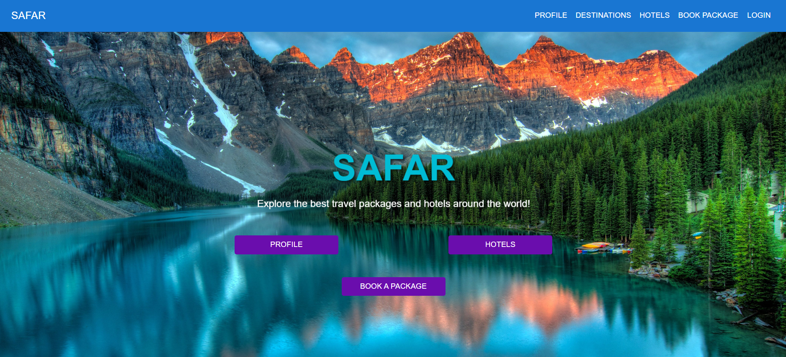
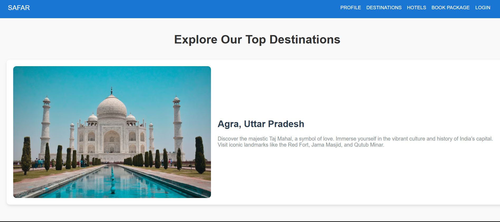
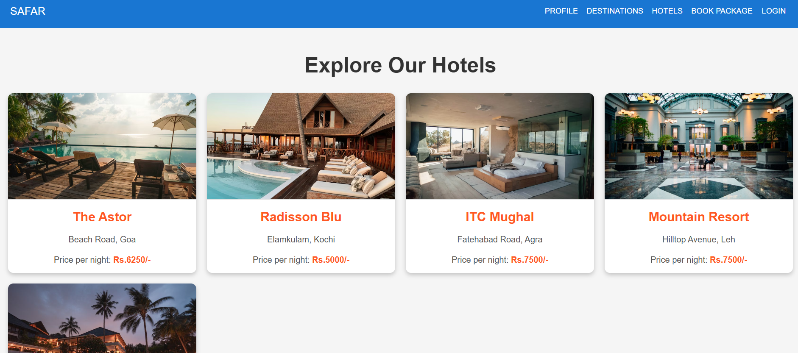
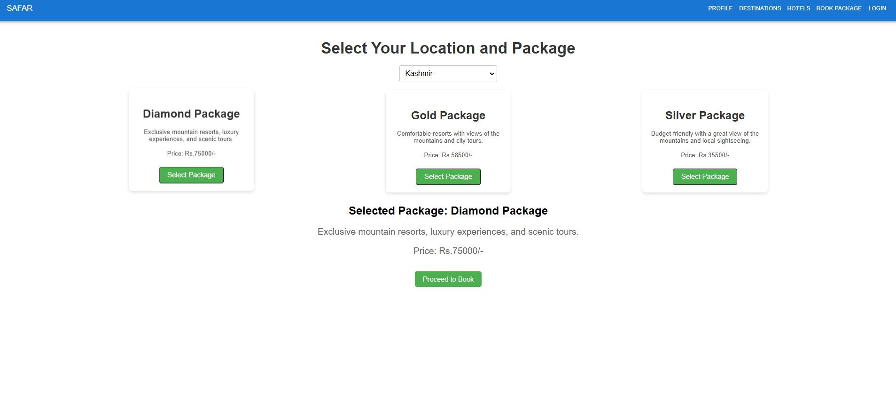
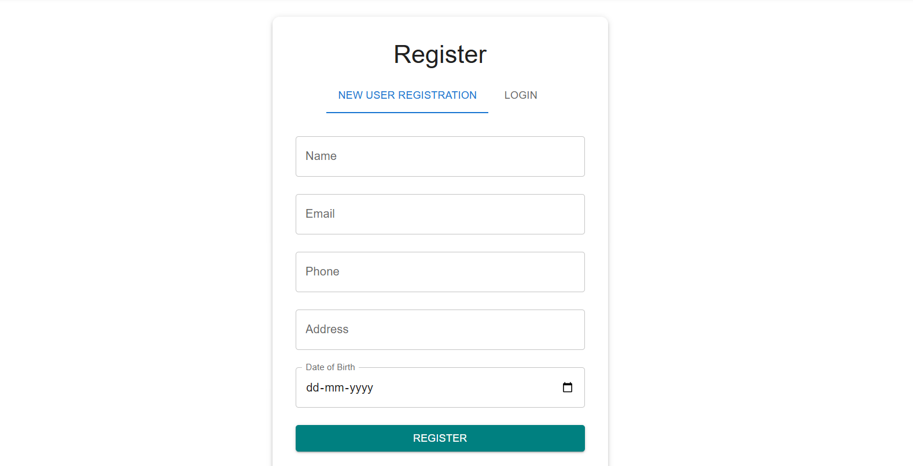
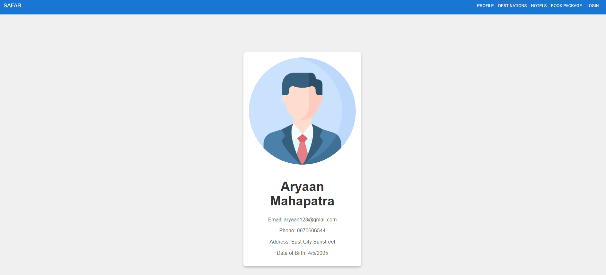

# SAFAR - Travel Management System ✈️🌍

SAFAR is a comprehensive, full-stack travel management platform designed to provide a seamless booking experience for hotels and global vacation packages. Built with a modern React frontend and a secure Express/PostgreSQL backend, this application features dynamic data fetching, interactive state management, and a fully responsive UI.

## 📸 App Screenshots

| 🏠 Homepage | 🗺️ Destinations Exploration |
| :---: | :---: |
|  |  |
| **🏨 Live Hotel Database** | **📦 Package Selection & State** |
|  |  |
| **🔐 User Registration** | **👤 User Profile** |
|  |  |

---

## 🚀 Features

* **Dynamic Data Rendering:** Hotel listings and pricing are fetched in real-time from a PostgreSQL database via RESTful APIs.
* **Complex State Management:** Interactive package booking engine that dynamically updates UI components based on user selection.
* **Component-Driven Design:** Built with reusable React components, custom hooks, and cleanly separated logic.
* **Secure Architecture:** Backend environment variables securely handle database credentials and routing configurations.
* **Custom UI/UX:** Smooth page transitions, hover effects, and localized CSS animations (like custom loading states).

## 💻 Tech Stack

* **Frontend:** React.js, React Router DOM, HTML5, CSS3
* **Backend:** Node.js, Express.js, CORS
* **Database:** PostgreSQL, node-postgres (`pg`)

---

## 📂 Project Structure

    safar-travel-management/
    ├── travel-backend/          # Node.js & Express API backend
    │   ├── .env                 # Environment variables (DB credentials)
    │   ├── server.js            # Main Express server and RESTful routes
    │   ├── package.json         # Backend dependencies
    │   └── package-lock.json
    ├── triptravel/              # React.js Frontend
    │   ├── public/              # Static assets
    │   │   ├── background.jpg   # Local UI hero background
    │   │   ├── jeep.gif         # Custom loading animation
    │   │   └── index.html
    │   ├── src/                 
    │   │   ├── components/      # Reusable UI components 
    │   │   ├── App.js           # Main application routing
    │   │   ├── App.css          # Global stylesheet
    │   │   └── index.js         # React DOM entry point
    │   └── package.json         # Frontend dependencies
    ├── screenshots/             # Embedded repository images
    │   ├── homepage.jpg
    │   ├── hotels.jpg
    │   ├── destinations.jpg
    │   ├── package-selection.png
    │   ├── register.png
    │   └── profile.png
    ├── .gitignore               # Excludes node_modules and secret environments
    └── README.md                # Project documentation

---

## 🛠️ Local Installation & Setup

To run this project locally, ensure you have Node.js and PostgreSQL installed on your machine.

### 1. Clone the Repository
    git clone https://github.com/AryaanM/safar-travel-management.git
    cd safar-travel-management

### 2. Database Setup (PostgreSQL)
1. Open pgAdmin and create a new database named `travel_db`.
2. Open the Query Tool and run the following SQL script to create the table and seed the data:

    CREATE TABLE hotel (
        id SERIAL PRIMARY KEY,
        name VARCHAR(255) NOT NULL,
        address VARCHAR(255) NOT NULL,
        price INTEGER NOT NULL,
        image TEXT NOT NULL
    );

    INSERT INTO hotel (name, address, price, image) VALUES
    ('The Astor', 'Beach Road, Goa', 6250, 'https://images.unsplash.com/photo-1582719508461-905c673771fd?auto=format&fit=crop&w=800&q=80'),
    ('Mountain Resort', 'Hilltop Avenue, Leh', 7500, 'https://images.pexels.com/photos/2869215/pexels-photo-2869215.jpeg?auto=compress&cs=tinysrgb&w=800'),
    ('Radisson Blu', 'Elamkulam, Kochi', 5000, 'https://images.unsplash.com/photo-1566073771259-6a8506099945?auto=format&fit=crop&w=800&q=80'),
    ('Leela Palace', 'Raja Annamalai Puram, Chennai', 7500, 'https://images.pexels.com/photos/258154/pexels-photo-258154.jpeg?auto=compress&cs=tinysrgb&w=800'),
    ('ITC Mughal', 'Fatehabad Road, Agra', 7500, 'https://images.unsplash.com/photo-1578683010236-d716f9a3f461?auto=format&fit=crop&w=800&q=80');

### 3. Backend Setup
Navigate to the backend directory, install dependencies, and set up your environment variables.

    cd travel-backend
    npm install

Create a `.env` file in the `travel-backend` root folder with your credentials:

    DB_USER=postgres
    DB_HOST=localhost
    DB_NAME=travel_db
    DB_PASSWORD=your_pg_password
    DB_PORT=5432
    PORT=5000

Start the backend server:

    node server.js

### 4. Frontend Setup
Open a new terminal, navigate to the frontend directory, install dependencies, and start the React app.

    cd triptravel
    npm install
    npm start

The application will open automatically at `http://localhost:3000`.

## 📄 License
This project is licensed under the MIT License - see the LICENSE file for details.